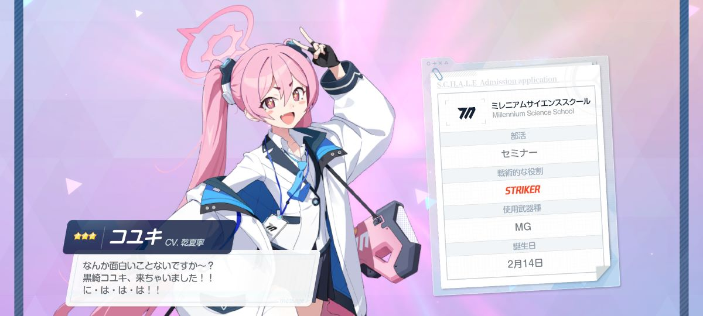

今日書いたViewModelの話、最初はDiaryの方で上げようかなと思っていたのですがBlogの方で上げました

Diaryの方は基本的にタイトル無し、サッと書いてサッと上げる、タグ分類はしない方針なので技術的なメモはちょっと特性に合わないかな・・・という気がしたのです

~~まあBlogの方に上げるネタが不足してるのもあるけど~~

いや、まだ上げていないものが幾つかあるけど画像の用意とかめんどくさいことをしなきゃいけなくて、アプリ作りで忙しい今は上げれないのですよ・・・

そもそも、こっちでは個人的な日記を書くだけにする予定だったので・・・

---

なので個人的な日記

20連で出た。ありがとう運営。~~その調子でバニーも実装してくれ~~

ちなみにトキは結構回した。辛い。

---

せっかくだしMastodonアプリの進捗も書いとこうかな？

- ストリーミングAPI対応
- クライアントキーを自動取得するようにして、どの鯖でもOAuth可能にした
- カラム種類追加(リストやふぁぼ一覧、ブックマーク一覧)
- UIテコ入れ(タブをアクションバーに統合してスペース節約したり、投稿にCardViewを適用させて今風にしたり)

ただ、ベータ版としてapk配布するのに必要な実装がまだまだ残ってたりする(おい)

- アプリからのアカウント削除
- 投稿削除
- ふぁぼやブーストの取り消し
- フォロー・フォロリクの処理
- アンケートの表示

何が何でも今月中に実装するぞするぞするぞうおおーー