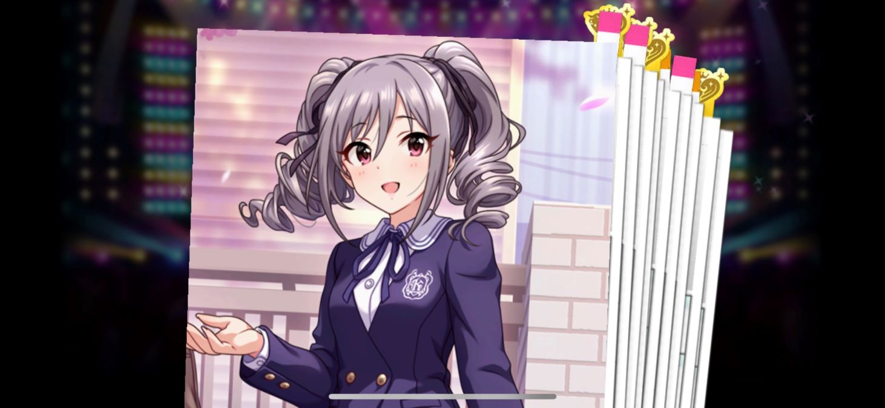

発狂

---

冗談はさておき

そろそろ何周目のSSRか分からなくなってきたデレステ

正直飽きてしまったのでもう全然プレイしていない　最後に遊んでから1年近く経ってそう

デレステの3Dモデル（特に蘭子の造形）は可愛くて好きだけど、所詮はソシャゲ上の限られた機能でしか利用することができない訳でして

Vroid Studioでオリキャラ作って遊ぶ楽しみと比べてしまうと・・・課金してまで手に入れる価値に疑問符が・・・

幸いにも無償石が尽きる前に出てくれたのでよかったけど、出なくても課金はせず諦めてたと思う

・・・うっかりするとデレマスへの不満が色々と出てしまうので程々に

てかVroid Studioで蘭子作るか・・・
