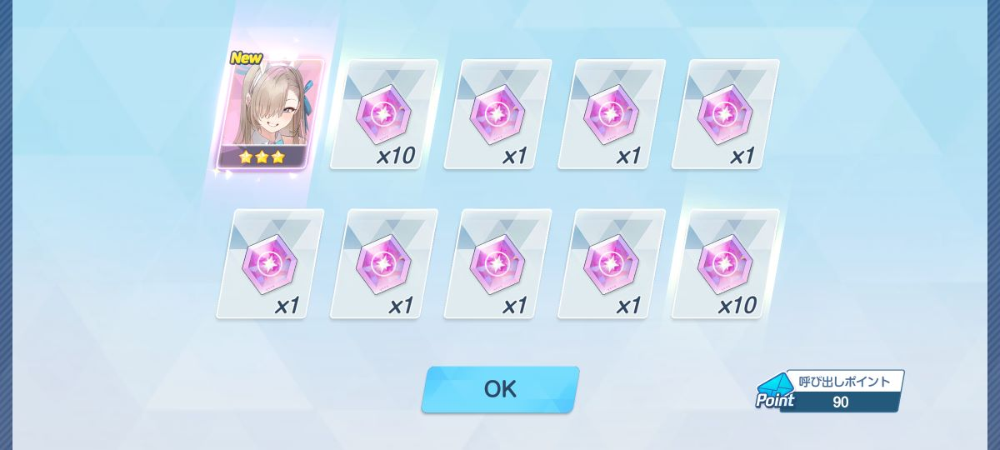
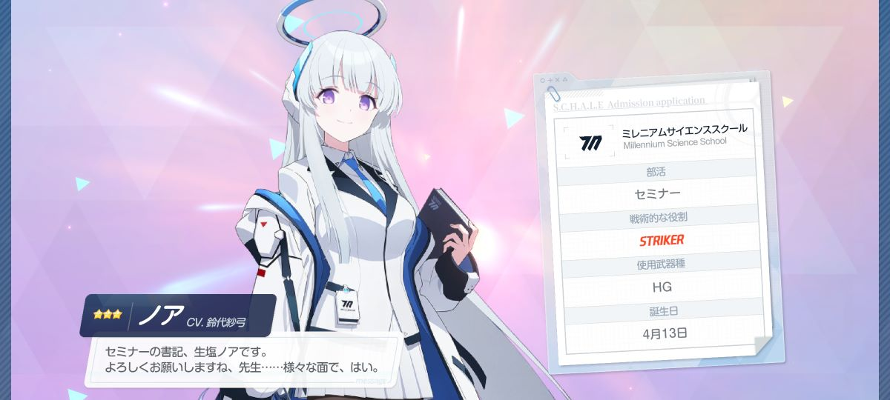
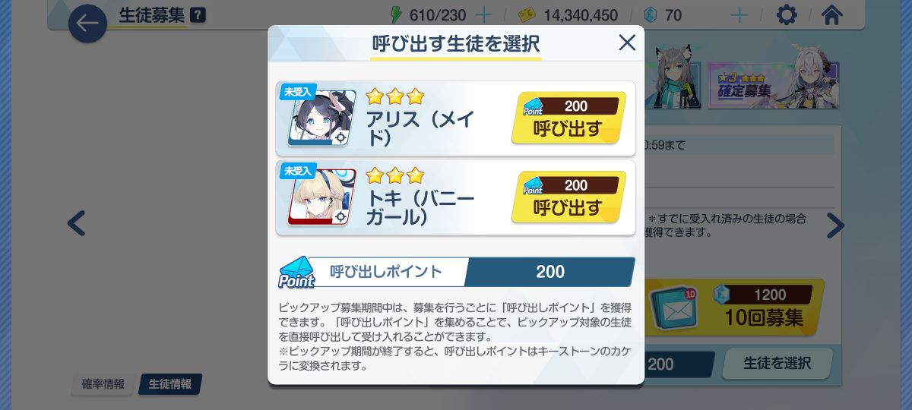

github pagesの方サボリ気味だったので適当日記

---

## Mastodonアプリ制作

2週間弱ほど私用を色々と消化してたので実はあまり進んでいないのです

3月末で一区切りつけたいと思ってたのに全然終わる気配がありません。悲しい

正直モチベが下がっていたというのも有ります

BindingAdapterというのを使ってUI関連の処理を纏めてスッキリさせようとしていたんですけど、画像の表示が絡むと不具合が色々生じてしまって大変なことになっていました・・・

具体的には、非同期処理で絵文字等の読み込みをした際にその画像が表示されない、というものです

そして現在も未解決です　

ので新しく追加した画面ではBindingAdapterを使わずにコードを書いたりしてます・・・

---

## 弐寺INF

半年ぶりくらいに弐寺INFに課金してオウチマニアしてました
- Almagest(H)フルコン(☆11はたぶんquasarぶりなのでうれしい)
- Sigmund(A)ハード
- 冥ランダムBP129
- 皆伝受けてみたら卑弥呼で死ぬ(灼熱は抜けるのか・・・)

冥と灼熱はわりと地力でなんとかなるようになってきました

ただ卑弥呼に癖がついてしまったのでもう終わりです　正直いつ皆伝受かるかわからない・・・

---

## ブルアカ

トキ2周目が早すぎてワンワン泣いてる

**別のバニーガールが出た。**

いや嬉しいけど！！！嬉しいけどさ！！！

**生　塩　ノ　ア　！　！　！**

そしてあっという間に天井に達したのでしためでたしめでたし

~~実は今月天井2回目~~

この200連の間に出た☆3が
- バニーアスナ
- 生塩ノア（フルネームで呼ぶ高校校歌）
- 水着ノノミ
- シュン

だったので、何がとは言わないけど大きいキャラピックアップガチャになってしまっている

~~だからトキちゃん出なかったの・・・？~~

とりあえず今月も生きたので偉い (オチが人としてどうかと思う)