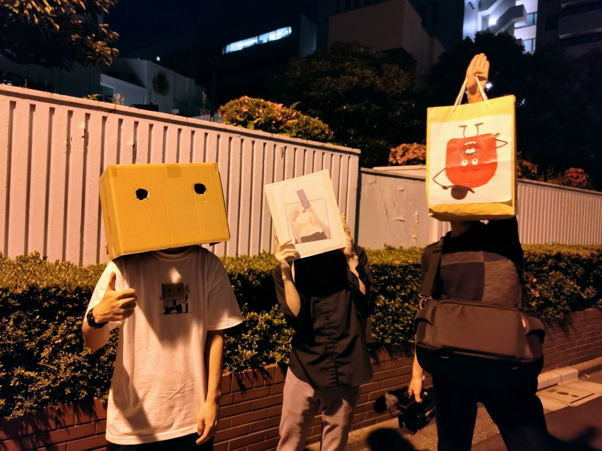
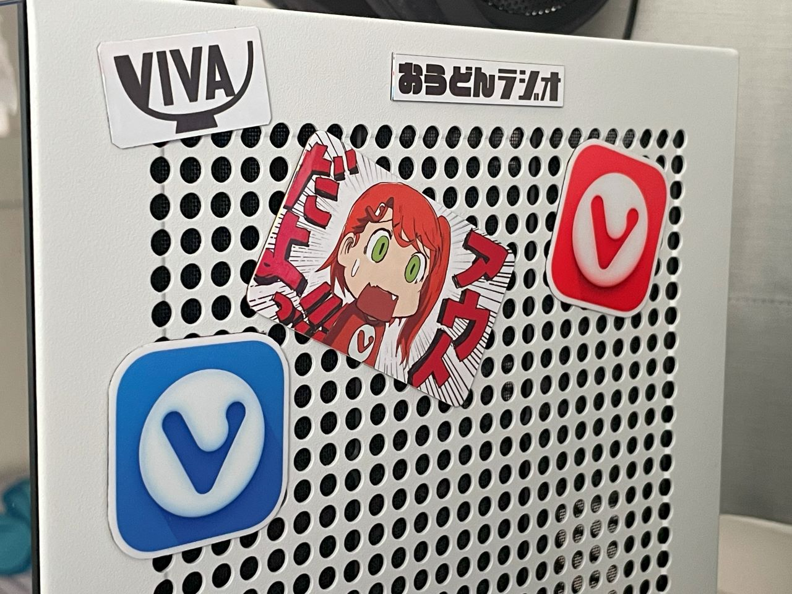

5/16に Vivaldi User Meetup TOKYO 2023 が開催されました

Vivaldi Socialのヘビーユーザー(大嘘)としては見逃せない！と、申し込んで参加してきました

なお道中の写真はございません

1つは緊張MAXだったため、もう1つはマルチタスクが苦手なため・・・

賑やかな場所へ赴くと、脳のリソースがその対応へ奪われてしまって写真を残すという発想が消滅するんですよね・・・私だけじゃないよね？

道中何があったか正直あんまりおぼえてにゃい

写真には写りたいけど顔バレは回避したいというワガママを成立しようとさせた結果こうなりました

ちなみにテっちゃんことVIvaldiのCEOとの2ショットも有りますがここでは割愛します(自分だけ顔を出さないのはアンフェアな気がするので)

いや分かんない　気が向いたらMastodonにうｐするかもしれない

**ごめんねテっちゃん・・・ありがとうテっちゃん・・・おふざけに付き合ってくれて・・・**

~~Vivaldi CEOとVRChatアバターが共演した世界初の事例~~

~~画像ハラデイ~~

緊張MAXとは言いましたが、(主に解散後に)こうしていろいろ変なコミュニケーションができたので良かったです

なんやらノベルティを沢山頂いてしまいました

マウスパッドを持ち帰ってから思ったけど、家ではトラックボールを使ってるから使い道が無い・・・どうしようかな

ちなみに左の細長いやつはケーブルホルダーです

~~最初パンの袋止めるやつかと思った~~

シールをマグネット化させました

~~何か怪しいものが混ざってますね~~

郵便受けに入ってた水道工事のマグネットの上からシールを貼っつけただけのお手軽工作です

これなら半永久的に使うことができるので神

赤いロゴの方はネットで買えるみたいですが、青いロゴの方は手に入らないようなのでレア度高めです

また機会があったら予備の分貰っておこう・・・（）

~~ライブ限定~~Tシャツ

また日本ツアーが開催されるのを期待しています　古の表現で全裸待機