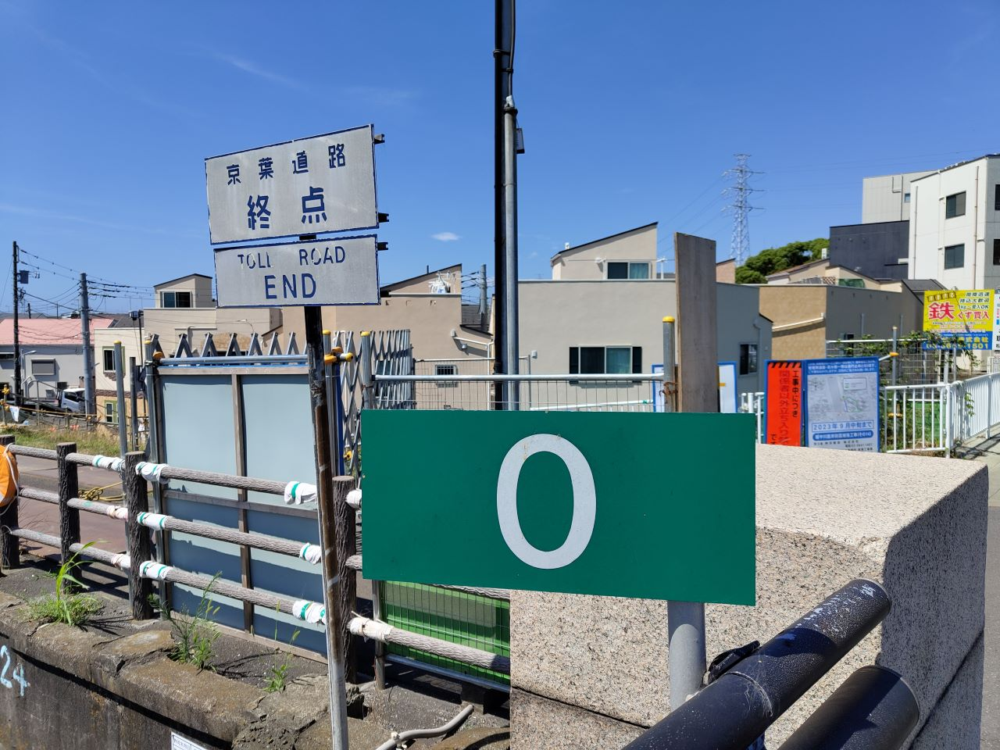
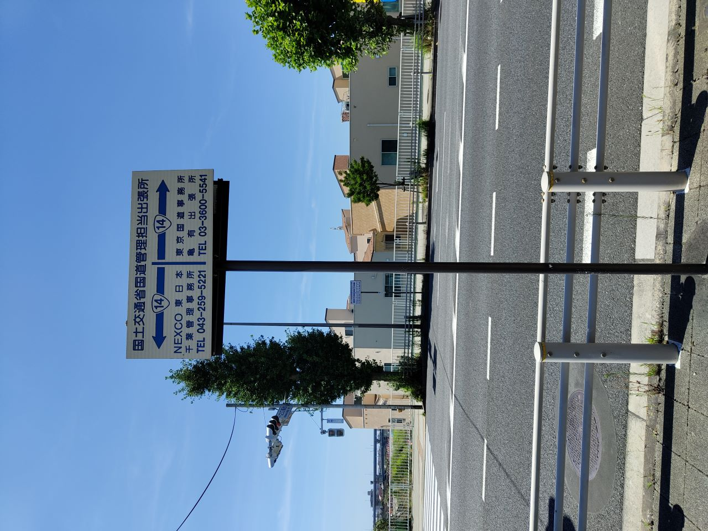
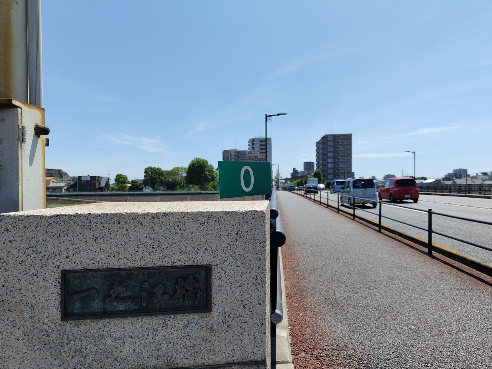
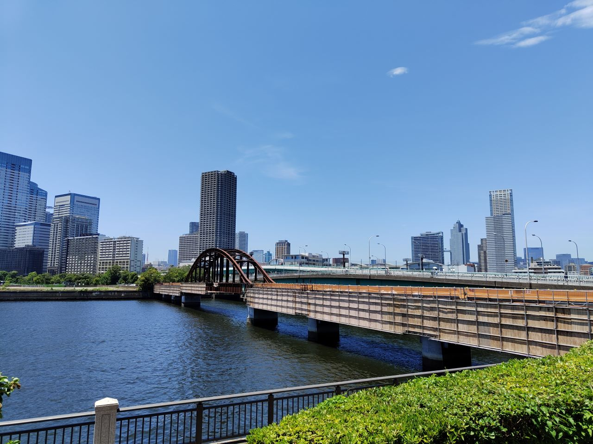
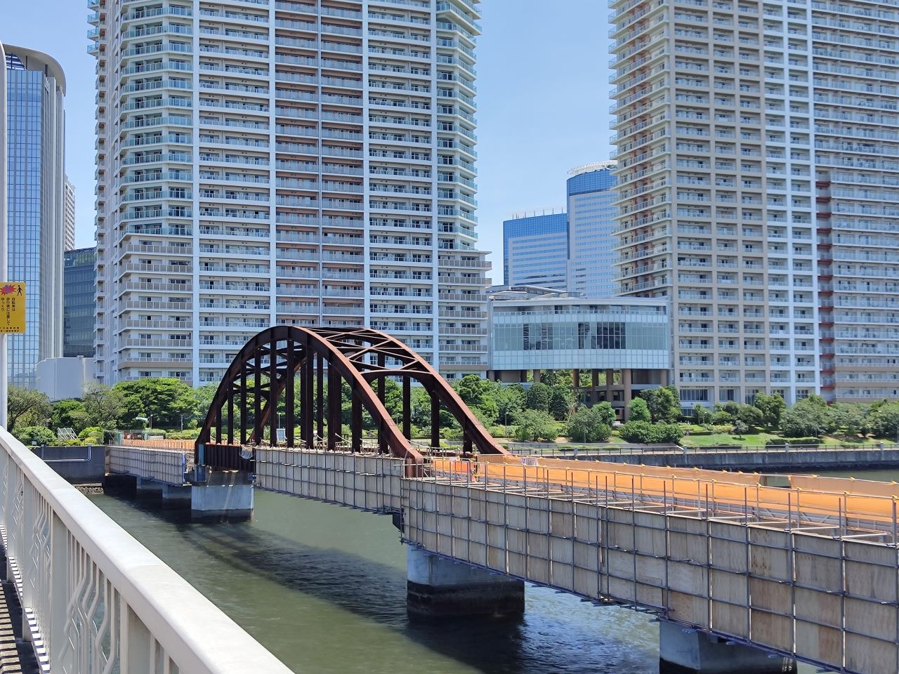
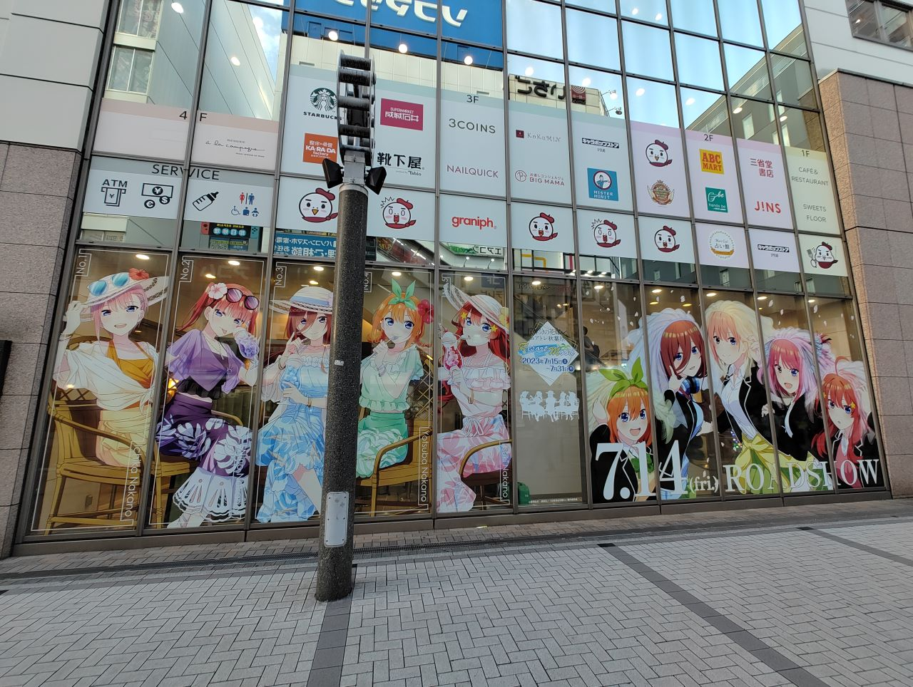

皆様は3連休いかがお過ごしでしょうか

日曜日はちょっといろいろ外出してきたのでその日記

午前は東京の東側をちょいと散策しました

---
## 日本で唯一らしい場所

最初のスポットはこちらです

一般道に植生する緑色の0キロポスト

ここは日本で唯一、緑色の0キロポストに素手で触れることができるスポットなのです

京葉道路の終端部分は、高速道路ではなく一般道の扱いになっています

首都高と直接繋がっている部分は、実は本当の終点では無いのです・・・本当の終点はそこから逸れた一般道の部分にあるのです

その為この0キロポストは歩道に面した場所に存在しています

てゆかもしかしてこの「終点」表記は公団ゴシックなのでは！

国道なのに京葉道路扱いなのでNEXCOの管轄になっています　オモロー

対向車線側にも0キロポストは存在するので厳密には日本で2箇所ですね

ちなみにこのスポットは何故か駅から遠いです

最寄りに都営新宿線の駅が3つくらいあるのですが、線形がこの一之江橋を避けるような形をしているのでどの駅からもだいたい2km弱あります

（うーんこの周辺に住んだら不便そうだなぁ・・・）

---

## 一足遅かった

続いて月島・勝どき方面へ移動しました

目的は鉄橋です

鉄橋と言っても昔の貨物線の廃線跡です

遊歩道として整備する工事が既に始まっていて、線路は剥がされていました・・・正直剥がさずにそのままであってほしかったなと思ったり

多分あと半年くらいはやく行けば線路が残ってたはずなのでちょっと悔しい

ちなみに作られたのは戦後らしいです　意外と新しかった

反対側へ回るとこんな感じ

タワマンを背にした風景がなんだかんだミスマッチしてる

---

## 映画見てきた

午後は公開されたばかりの五等分の花嫁∽を見てきました

記号がなんの記号だったか思い出せなくて数日モヤモヤしてたけど今思い出した　相似の記号かこれ・・・

なんで毎回数学の記号なんだろう、作者が数学好きなのかな

そのうち五等分の花嫁ε-δとか出るのかな（）

友人とお互いにお互いの好きなキャラを引いたので交換し合う（一花⇔五月）
・・・というのを去年色紙を手に入れた際にやったんですけど、今年も全く同じことをやりました

来年もまた同じことをするのかな（？？？？？）

---

全く関係ないんですけど
最近は同じ声優さんが演じてる別キャラの声を比較するっていうのが結構楽しい

デート・ア・ライブ視聴してるときに一瞬花澤香菜さんのキャラが出てきたんですけど花澤香菜っていうよりまんま一花って声で爆笑してしまった

他にも内田真礼さんとか出てるんですけど純度99%神崎蘭子なので脳がバグってます

デアラのキャラの声は竹達さんとかもかなり好きです・・・あれ二乃役も竹達さんだな・・・なんかもう最近自分の好みが分かりやすい自覚が出てきて勝手に傷ついています（？？？　

---

久しぶりに終日外出でつかれました

楽しかったけど腕が日焼けして痛いのでちょっと後悔しています

おたく自分語りはとりあえずこれくらいにしておきます

こう自分だけのスペース（Webサイト）で自分の好きなだけお喋りをするのは、すごい気が楽で良いですね～