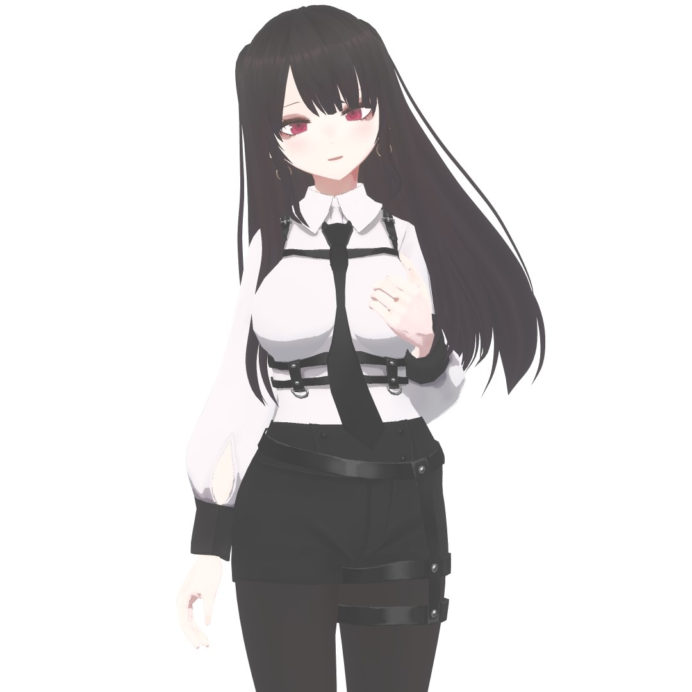

7月終わったんですね・・・

とりあえずVRoid着せ替え日記の回

最近BOOTHで購入した物を着せました

[【VRoid】クシィ テックウェアスーツ【テクスチャ】](https://booth.pm/ja/items/4288182)

~~調子乗ってデカくした~~

前髪変更Ver.

うーんこの衣装だとぱっつんの方がいいかも・・・

前髪ぱっつん、昔あんまり好きではなかったけどここ2～3年でなんか考えが変わりました　人間ってわからないものだね

画像貼ってから思ったけど折角よく出来ているブーツが見切れてしまっているではないか・・・！
VRoid Studio内で試着してスクショしただけなので適当になっています

VRM形式で出力して外部でいろいろやれやー！って感じです

---

VRoidの服って形状のプリセットが何個かあって、それに貼り付けるテクスチャ画像を差し替えることで着せ替えを実現しているんですけども・・・

それはつまり、服の形状自体のカスタマイズには限界がある、という事になります

「袖を膨らませる」とか「全体を膨らませる」とか、ある程度のパーツ毎のパラメータは存在するので、ダボッとした感じで着る～みたいな事なら可能なんですけど、立体的なデコレーションをするといった事は基本的に出来ません

細かい装飾類は全て平面になってしまうので、Blenderとかで作られたモデルにはどうしてもクオリティの差がついてしまいます

今回BOOTHで購入した衣装の、この満足度の高さは何処から来ているんだろうな～っとちょっと考えてみたのですが、ハーネス型のベルトに立体感があるんですよね・・・

どうやらショートパンツのベルト部分だけが別レイヤーとして独立している（厳密にはレイヤーとはまた異なるけど）みたいで、ベルトの方だけパラメータで全体的に一回り大きくなるように調整されていました

ようは重ね着して立体感を出しているという事になりますね、なるほどなあ・・・

これ同じ理屈でいけば細かい装飾も立体的に出来るのかな・・・いろいろ可能性が広がりそう

---

あ～VRoidのスクショだけひたすら貼っ付けるページとかあっても良いかもしれないな～とかちょっといろいろ考え中

でもそうすると日記の役目が1つ減ってしまうな・・・悩ましい