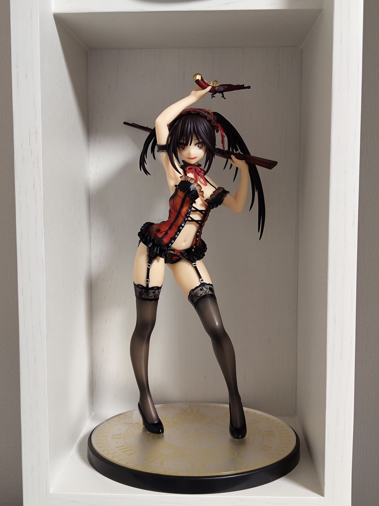
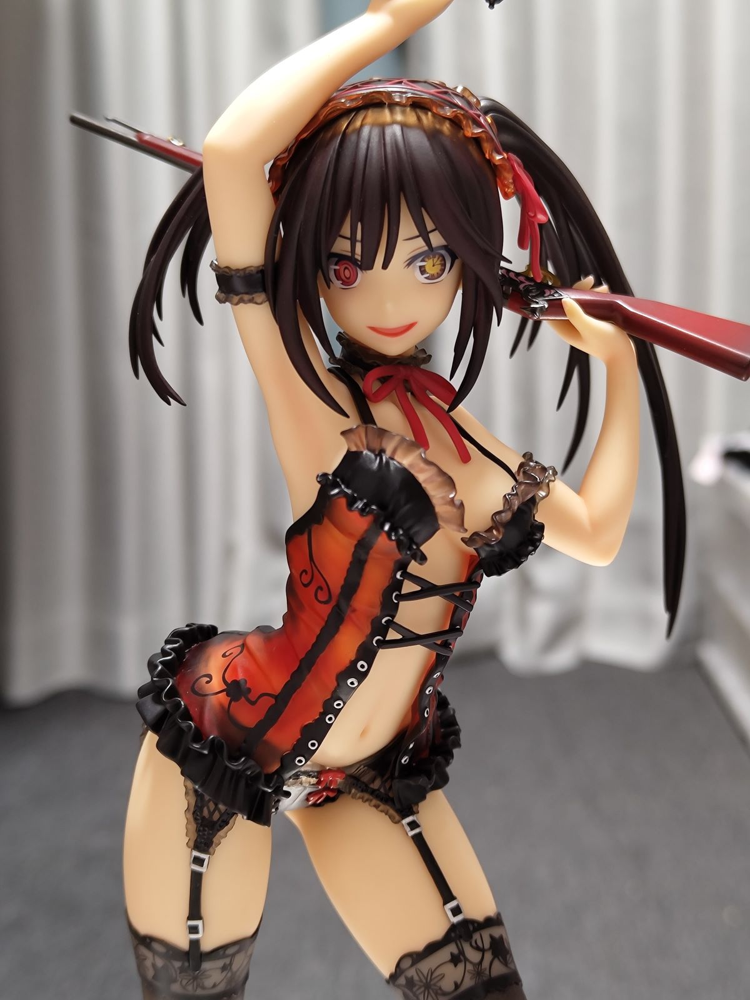

この前0キロポストを見に行った後、裏で散財していました

暫くぶりにお高いフィギュアを買ってしまいました 時崎狂三ちゃんです

~~ちょっと肌色面積多いので載せるの躊躇った~~

あみあみ限定差分パーツ(狂気顔)付の未開封品を見つけてしまったため・・・仕方なく・・・

フィギュアをちゃんと置けるスペースが無いので、無印良品の壁に取り付ける棚に飾ってるんですけどサイズがジャストすぎて感動してます（そこ？）

表情分かりやすいようにアップ

別のフィギュアだと、もっと表情の狂気度が高い物もあるのでそれに比べたらマイルド（？）な表情なんですがこれもこれで良いかなと

~~いやでもこの格好で臨戦態勢はおかしいでしょ~~

~~じゃあなんで買ったんですか？~~

狂三ちゃんって何かめちゃめちゃフィギュア化されてますよね

履修する前からあきばのお店で度々見かけていたので、見かける度に「あ～この子良いよね～」と思っていたんですけど、いざ履修してからもう一度フィギュア屋で見てみると

**「いやこんな服着てるの見たこと無いぞ？？？」** という事案が結構あって・・・

原作は完結・アニメは未完結なので、もしかしたらこれから出てくるのかもだけど・・・

~~フィギュアが作られすぎてネタ切れしてるのかな（割りと真面目に）~~

~~何ならこれは服かどうかも怪レい~~

あと差分顔の交換が難しすぎて壊すかと思った。顔交換するのに腕→髪飾り→髪→顔と順を追って色々外さないといけなくてなかなかめんどくさかった。髪飾りのパーツ固すぎ！！！　暫くは狂気顔のままにしておきます