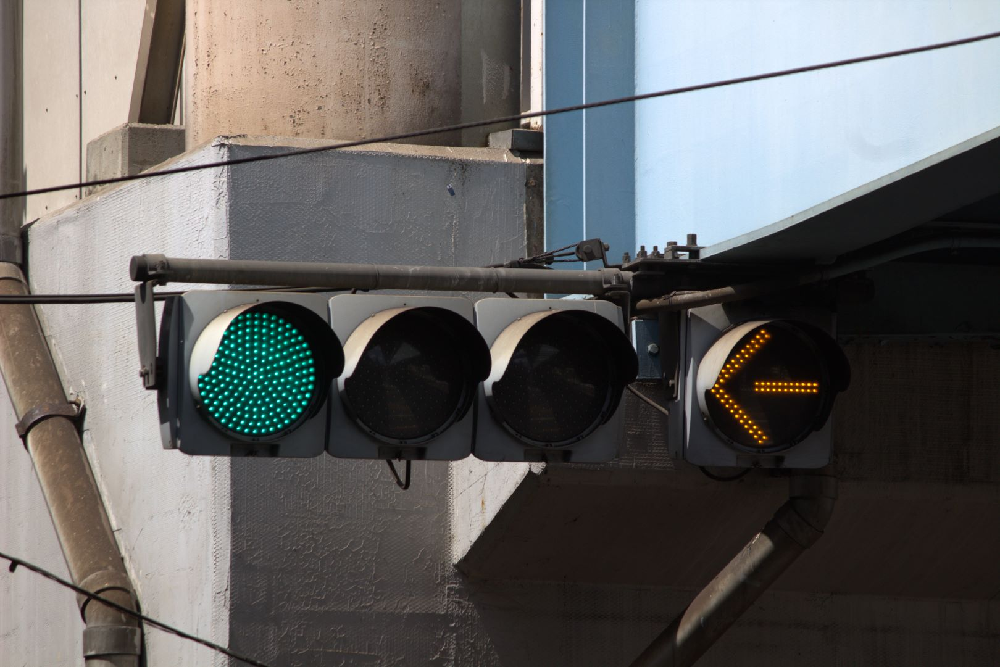
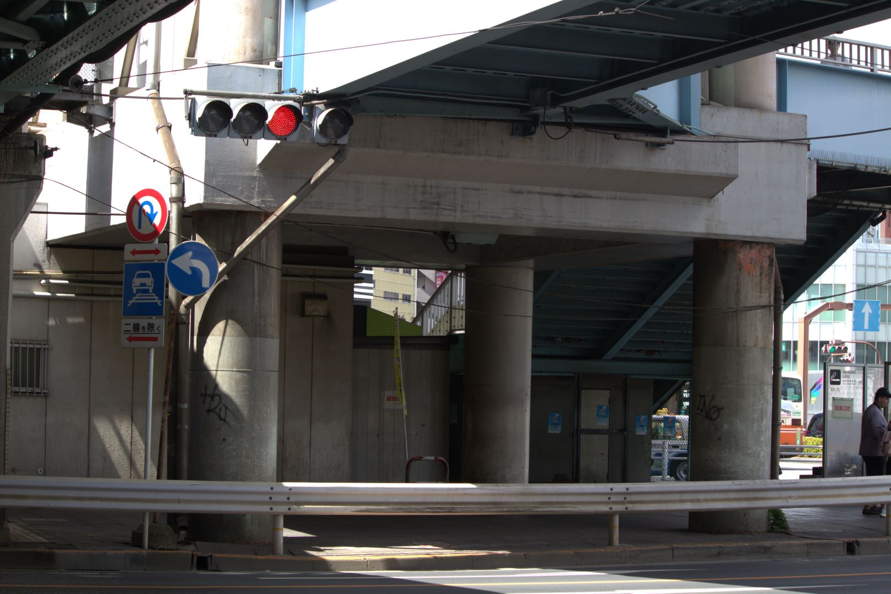
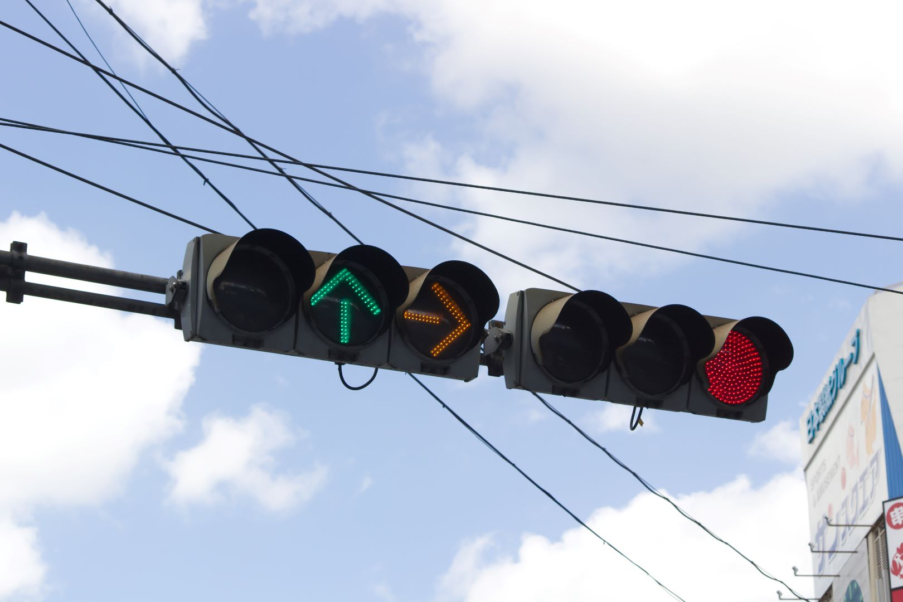
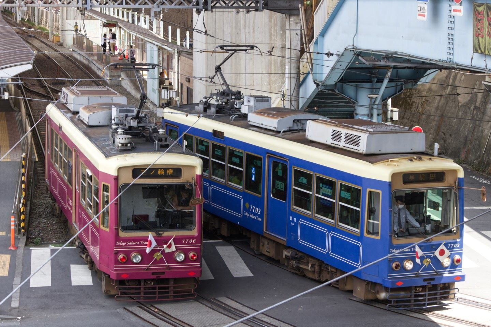
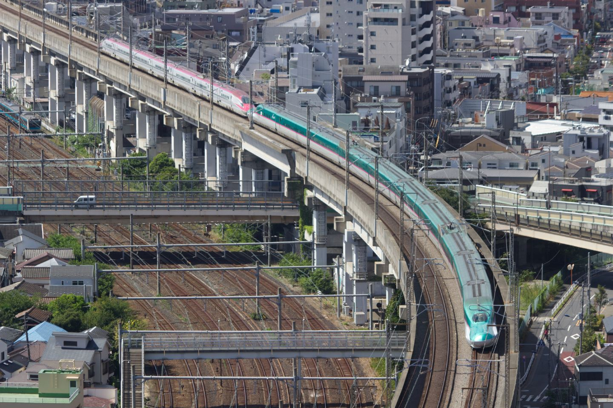
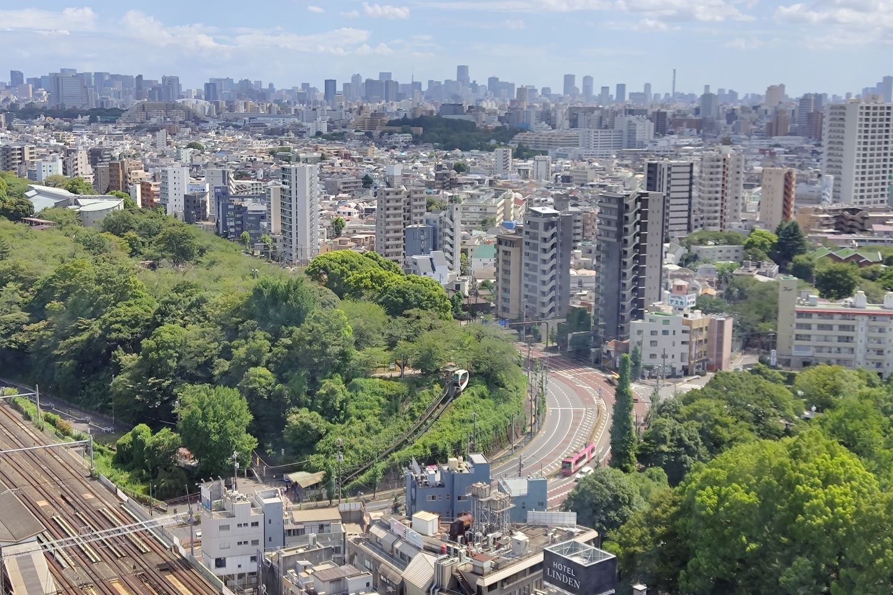
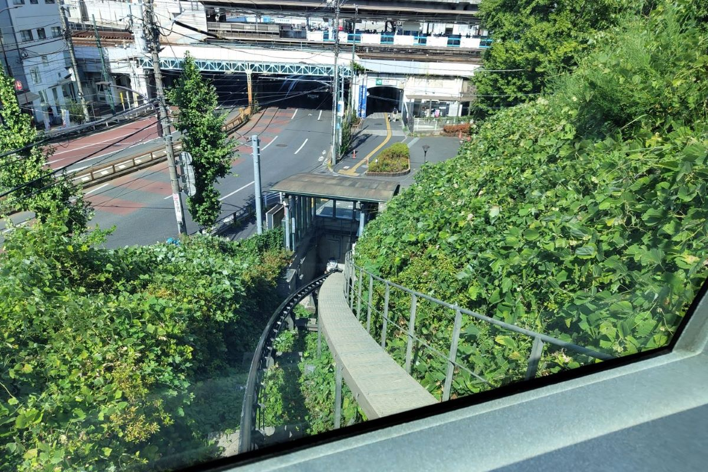
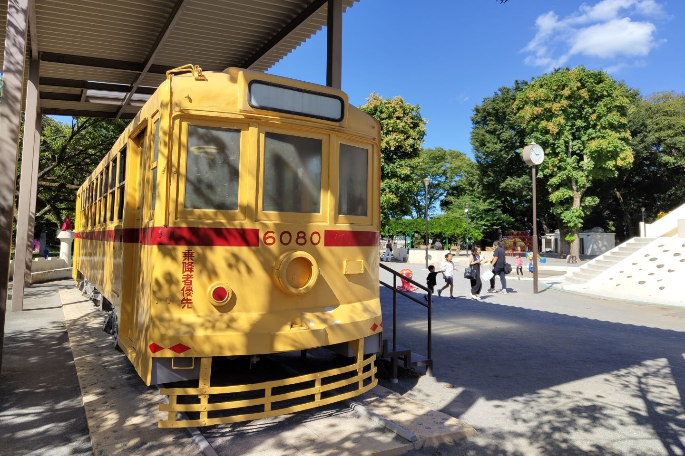
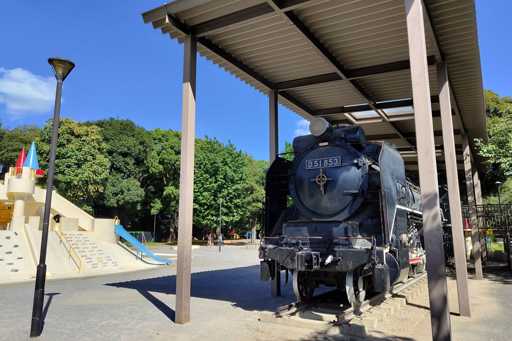

そろそろ散策タイムを設けておこうと思ったので午前からおそとフラフラ

いろいろ回ったけど写真が多くなりそうなので2回に分けて書くことに・・・

とりあえず王子駅周辺の散策を中心にまとめ

## 黄色い矢印

信号機の矢印って基本的に赤と同時に点灯すると思うんですけど

黄色い矢印の場合は路面電車用なので、青と同時に点灯している所を見ることができます

東京（っていうか関東だと）路面電車が都電だけなので割と貴重です

あーでも今度宇都宮にLRTができるから栃木でも見られるようになりますね！

軌道敷内通行可の標識も都内唯一？

宇都宮のLRTはたしか原則通行NGなので開業後も関東唯一？なのかな

こっちはガード下を抜けた直後にある信号

矢印用が横に並んでいるのも珍しい！黄色矢印もあるし個性バチバチで好きです

メインディッシュは信号機だったけど折角なので都電もパシャパシャしてました 7700形は初履修です

違う色同士で並ぶと華がありますね～

よくよく見ると片方は車両の向きが逆ですね（屋根の冷房とかの向きが逆）

車庫への入口はデルタ線になっているし、特に向きとかは決まっていないんでしょうか？

---
## 眺め

暑いので屋内へ避難します

駅前のビル（北とぴあと言うらしい）の最上階が展望台として開放されているので見に行ってきました

~~都庁とかだと手荷物検査があってめんどくさいですが、こちらは入り口のすぐ横にあるエレベーターから直行できるので引きこもりに優しいですね！！~~

東北新幹線の線路がすぐ横を通っています

ここには1回来たことがあるのですが確か高校生の頃だったので・・・■年ぶりか・・・グェ

南側からは都電が走っているところも見れます

**っていうかなんか謎の乗り物がある**

---
## 飛鳥山公園登頂

というわけで乗りました

無人運転だけど上と下の乗り場では係員の人が常駐していました　やっぱ東京都ってお金持ってるなぁ（そこ）

飛鳥山公園のウェブサイトを見たら一応「モノレール」って書いてありました

~~なんかレールがみかん畑とかにありそう~~

都電が置いてあるのは前から知ってたけどSL置いてあるのは知らなかった

遊具がおいてあるので結構子どもも多かったです

友人と一緒に来たのは正解でした

~~(1人で挙動不審にカメラを持って徘徊することになるので)~~

1人じゃなければ怖いものなしなので子どもたちに紛れてSLの運転台に突入したりしてました

あとなんだろう　北区は渋沢栄一を結構推しているみたいで、のぼりとかポスターとか色々見かけたんですけど、そっち方面は素人オブ素人なので割愛😇

他に回った所はまた今度まとめよう・・・

