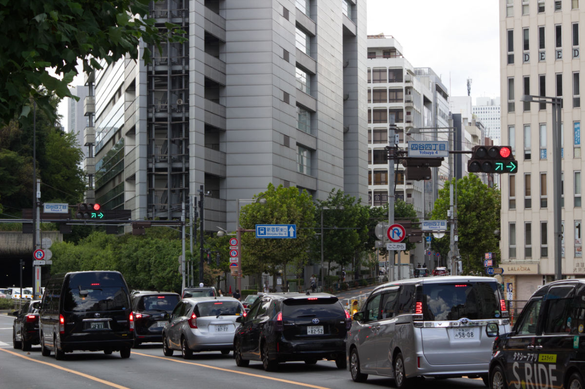
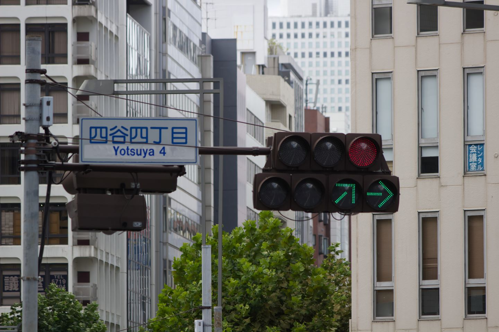
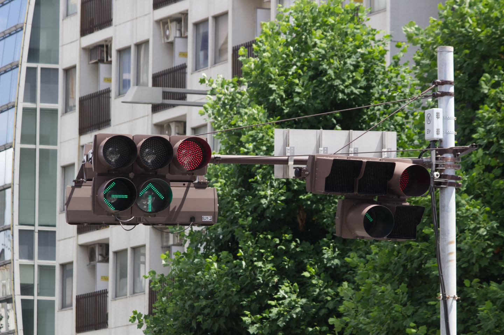
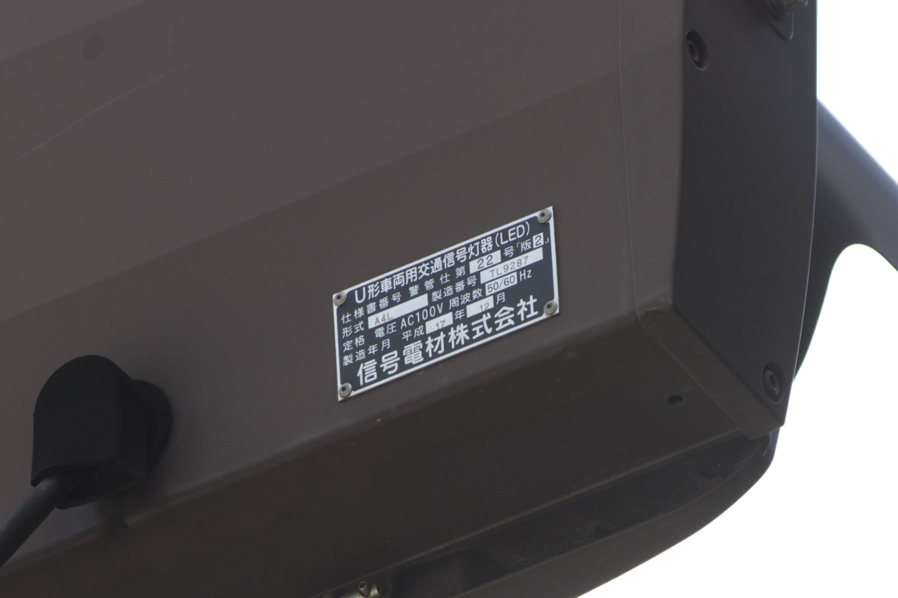
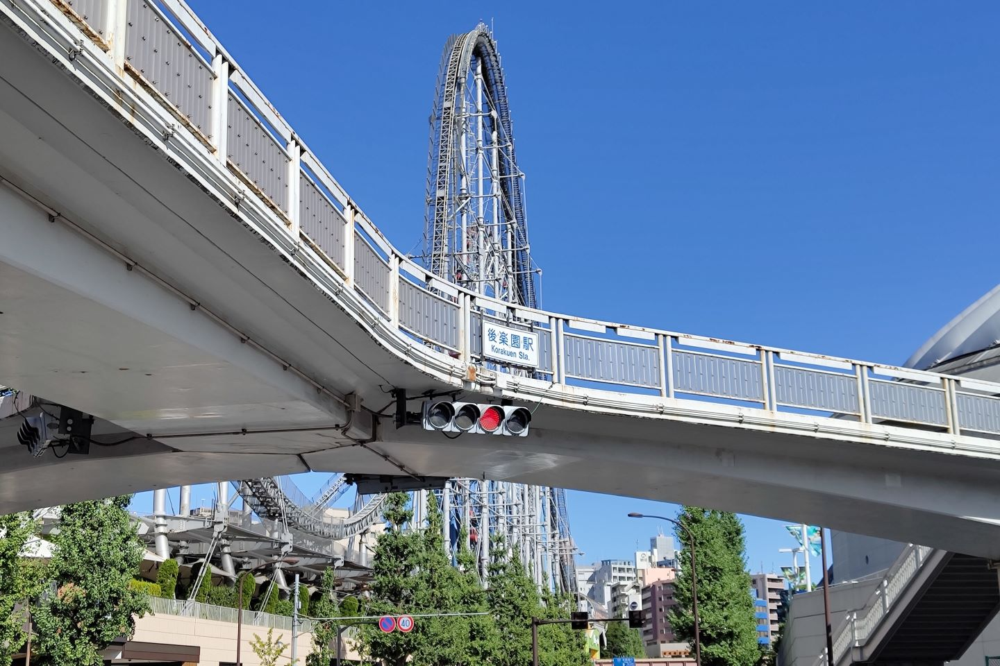
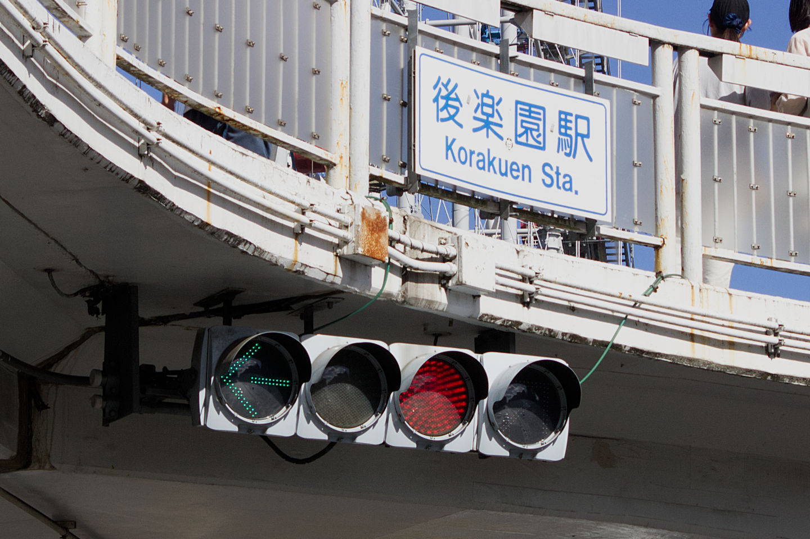
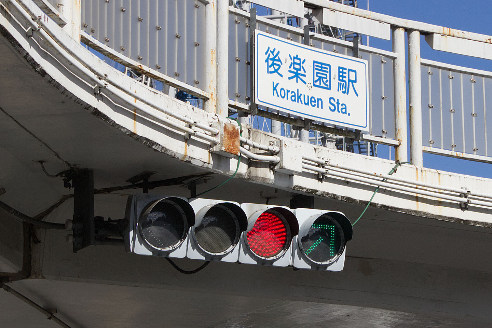
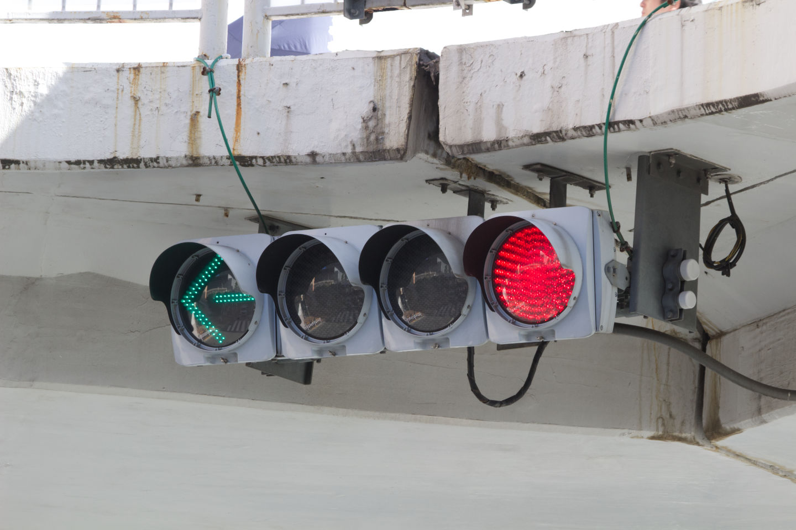
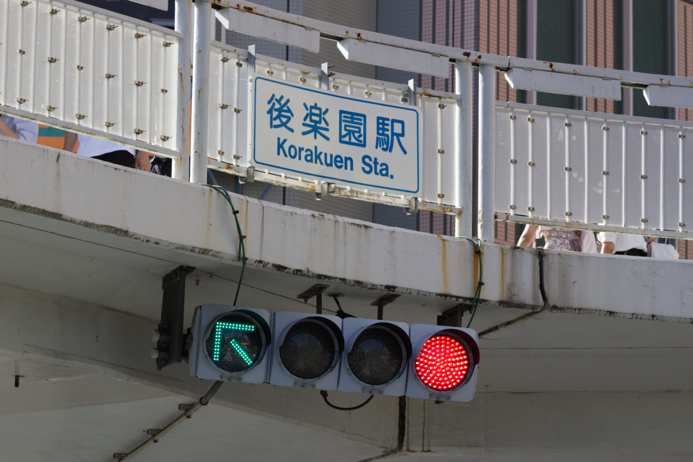

前回の散策のつづき（と言っても時系列はもどる）

ひたすら東京の信号機を見物してました

---
## 四谷四丁目

最初に目指すは四谷四丁目交差点！　四がいっぱい

ここの交差点には矢印信号が4つもあります

斜めの矢印ってなんか可愛いよね（？）

拡大して見てみると、英語表記の部分にシールを貼った跡が・・・

ここ数年でローマ字表記を英語表記に改めてるらしいのでそれ関連かな

きっと元々は「Yotsuya 4chome」とかそのままローマ字だったんでしょうけど、「chome」って何やねんってなりますもんね

でも電車の駅名って頑なにローマ字表記ですよね、四谷三丁目駅とか普通に「Yotsuya-sanchome」とかだし・・・

~~chromeに見えてきた~~

反対側は鋭角交差点になっているので誤認防止のカバーがいっぱいついてます

四角いカバーと丸いカバーってどう使い分けてるんだろう　なにもわからない

製造元の表記全然撮ってなかったけどここだけ撮ってた

AC100Vってことはコンセント挿せば普通に家でも動かせるのかな

お恥ずかしながら信号電材という会社を今までしりませんでした

---
## 後楽園駅

東京メトロの一日券で散策してたので、その中で回れる場所を中心に当たっていきました

お次は後楽園

あとから写真を見返してみると橋の構造もおもしろいな～と気づく

アーチを3又に拡張したような形をしてますね　キレイなY字だからこそなせた業！

矢印が横に並んでいるだけでも珍しいけど、よくよく見ると青信号が無い！

ここの交差点に付けられた信号機は、それぞれの個体で微妙に異なるものを使用しています

他2つの個体は矢印が1つのみで、青信号もちゃんとあります

最後の個体は斜め矢印　かわいいね

後楽園の信号機は、駅のホームから見えるので昔から知っていました

が、他2つの個体は死角にあるので今回初めて見ることができました

矢印2つの個体は駅からは見えません　ちゃんと現地に赴いてよかった～

他にも少し別の所を回ったんですけど、また写真がいっぱいになってしまったので一旦区切ることにします

そろそろ日記にもカテゴリーを付けたほうがいいかしら・・・
